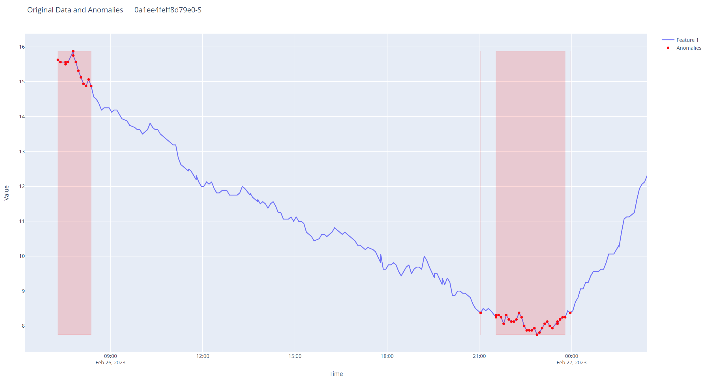
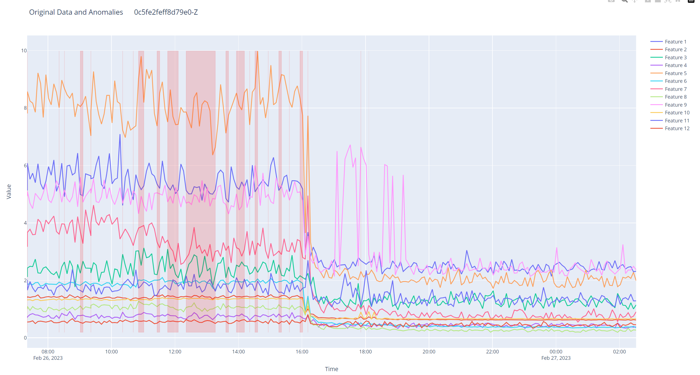

# fastApiProject_anomaly_detection
##  csv读数据
对datasets（temperature\raw）中的数据进行异常检测。

输出结果包括重复值（位于datasets\{temperature or vibration}\output）和异常点.

## json 读数据
运行后使用postman将json数据上传到FastAPI的服务器上，输出结果。

文件main.py,是使用fastapi构建的API。

1. 支持temperature/vibration两种格式的csv/json输入。
2. 支持k-sigma、boxplot、lstm异常检测方法。
3. 支持k-sigma、boxplot、lstm数据修复方法。 
4. 支持json格式的输出（lstm具有可视化）。
## 可视化
### temperature 单维

### vibration 高维
